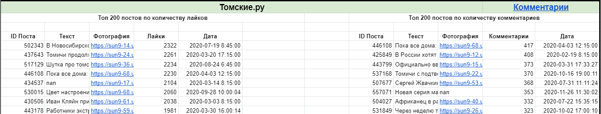

# Анализ комментариев студентов ТУСУРа

*Все комментарии были обезличены, передавался только текст и кол-во слов в категории*

*[Ссылка на гугл таблицу] (https://docs.google.com/spreadsheets/d/1c7_8h25_KZjFl--DUqN9c_TlkllJ5dFV7sfzdr_ZV7s/edit?usp=sharing)*

### Сбор ID студентов

Из официальных и неофициальных групп, связанных с ВУЗом были собраны id пользователей.

Всего было взято 11 групп, некоторые из них:

1.	[ТУСУР Подслушано;](https://vk.com/tusuroverhear)
2.	[ТУСУР online;](https://vk.com/mytusur)
3.	[Спортивно-оздоровительная комиссия (СОК) ТУСУР.](https://vk.com/sok_tusur)

### Сбор групп ВК по ID студента

Был составлен ТОП 1000 групп, в которых состоят студенты ТУСУРа.

|Название группы|Тема группы|ID группы|Кол-во студентов|
|:--------------:|:-----------:|:---------:|:----------------:|
|Томские.ру|Городское сообщество|26762265|2048|
|Регион-70 Томск|Городское сообщество|60130670|1874|
|MDK|Юмор|57846937|1475|
|Черный список Томска|Городское сообщество|93250065|1297|

### Сбор постов в группах ВК

Были собраны все записи в группе, начиная с 01.01.2020.

Далее составлен ТОП 200 записей по кол-во комментариев и лайков.

### Сбор комментариев студентов

Для каждой группы были собраны комментарии студенов с ТОП 200 записей по кол-во комментариев и лайков.

Был дан словарь слов, разделенный на 6 категорий:

1.	социальность;
2.	личность;
3.	карьера и трудоустройство;
4.	волонтерство;
5.	будущее;
6.	политика.

Было посчитано кол-во вхождений элементов словаря в комментариях студентов

Пример для группы [Регион 70:](https://vk.com/tomsk123)

|Категорич|Кол-во слов|
|:-------:|:---------:|
|Социальность|6|
|Лиичность|4|
|Карьера и трудоустройство|14|
|Волонтерство|10|
|Будущее|1|
|Политика|10|

Для всех комментариев таблица выглядит следующим образом:

|Категорич|Кол-во слов|
|:-------:|:---------:|
|Социальность|59|
|Лиичность|11|
|Карьера и трудоустройство|137|
|Волонтерство|60|
|Будущее|19|
|Политика|97|